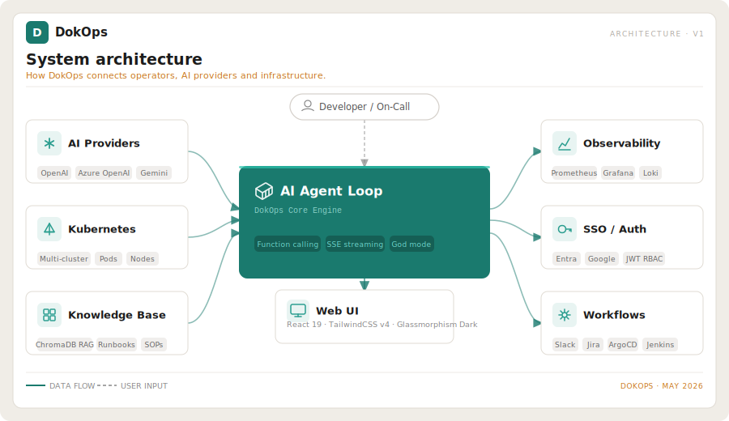

# DokOps — Kubernetes DevOps Platform

A production-grade **Kubernetes DevOps Platform** with an AI agent loop, MCP server integration, and a full-featured Web UI. DokOps acts as an autonomous DevOps assistant: it gives AI agents safe, structured access to your Kubernetes clusters while keeping humans in full control via role-based access and an explicit approval gate for destructive actions.



---

## What DokOps Actually Does

### AI Agent Loop
- Accepts natural-language requests (e.g., *"Why is my pod crashing?"*, *"Scale nginx to 5"*)
- Runs an internal function-calling loop using OpenAI, Azure OpenAI, or Google GenAI
- Recursively invokes Kubernetes tools (get logs, events, metrics, describe) until it reaches a root cause
- Streams intermediate agent steps and final responses to the UI via Server-Sent Events (SSE)
- Maintains full conversation history with token usage tracking per message
- **AI Token Optimization** — `CachingAIClient` delivers provider-aware prompt caching, a configurable fast/cheap model tier for simple calls, and automatic message-window trimming to stay within token budgets
- **Prerequisite validation** — before each AI loop, DokOps checks connectivity to all active observability integrations and the Kubernetes cluster; unhealthy tools are automatically removed from the AI's tool registry and SSE warning events are streamed to the browser
- **Container registry lookup** — the agent can call `search_container_image` to query Docker Hub, GHCR, Quay.io, registry.k8s.io, and user-added private registries via OCI Distribution Spec APIs when diagnosing `ImagePullBackOff` errors

### Kubernetes Management
- **Pod operations:** list, describe, get logs, exec commands, get metrics, delete
- **Deployments:** list, describe, scale, restart, patch environment variables, get YAML
- **Services & Networking:** list services, get endpoints, describe ingresses, get network policies
- **Nodes:** list nodes, describe node, get node metrics (CPU/Memory)
- **Storage:** list PVCs, describe PVC, list StorageClasses
- **Config & Secrets:** list ConfigMaps, get ConfigMap data, list Secrets (names/keys only — values are never exposed), patch Secrets (God Mode only)
- **Namespace management:** list, create, delete (God Mode)
- **Multi-context clusters:** connect and switch between multiple kubeconfig contexts
- **Mock Mode:** full UI and API functional without a real Kubernetes cluster (for development/testing)

### Topology & Diagnostics
- **Cluster Topology Service:** builds a live dependency graph (Pods → Services → Ingresses → ConfigMaps → PVCs → Nodes) using NetworkX
- **Topology Visualization:** interactive force-directed graph in the UI
- **Blast Radius Tool:** AI can query which resources will be affected by changing a given resource
- **Diagnostic Engine:** structured health checks across container state, probes, networking, storage, RBAC, scheduling, security context, and resource limits

### Runbooks
- Markdown-based runbooks stored in `backend/app/runbooks/`
- Covers: CrashLoopBackOff, OOMKilled, Pod Pending, Service Unreachable, High CPU/Memory on nodes
- AI automatically selects and executes the appropriate runbook steps during troubleshooting

### Knowledge Base (RAG)
- Ingest custom documentation, runbooks, and SOPs into ChromaDB
- AI retrieves relevant context from the knowledge base before answering
- Manage documents via the UI (upload, delete, search)
- **Confluence integration** — connect Confluence Cloud or Server/DC; sync spaces and individual pages directly into the knowledge base, with optional scheduled sync
- **Background ingest** — upload and URL-ingest endpoints return a `job_id` immediately; poll `GET /api/v1/rag/jobs/{job_id}` for status; large documents never block the server
- **Batch embedding** — all chunks are embedded in a single provider call instead of one-by-one, significantly reducing ingest time on large documents

### Observability Integrations
Connect to external observability tools. AI can query these during incident triage:
- **Prometheus** — PromQL metric queries
- **Grafana** — dashboard and panel data
- **Elasticsearch / OpenSearch** — KQL log queries
- **Loki** — LogQL log queries
- **Datadog** — metrics and logs API

### Azure Integration
- Connect an Azure subscription via client credentials (stored encrypted)
- Query Azure Cost Management for cost anomalies and optimization recommendations
- AI uses `get_azure_cost_recommendations` tool during financial triage

### MCP Server Integration
- Register and manage external MCP (Model Context Protocol) servers
- AI can discover and invoke tools from connected MCP servers dynamically
- DokOps itself also exposes an MCP-compatible server endpoint for external agents

### Minions — On-Premise Remote Agent Fleet
DokOps includes a lightweight remote agent system for managing **non-Kubernetes infrastructure** (bare-metal servers, VMs, on-prem devices — Linux **and Windows**) alongside your clusters.

**How it works:**
- Install the agent on any Linux or Windows machine — no external dependencies beyond Python 3
- The agent connects back to DokOps over a persistent, **token-authenticated WebSocket** and registers itself with system metadata ("grains"): hostname, OS, arch, CPU count, memory, IP, installed tools
- New agents start in `pending` state and require **God Mode approval** before they can accept commands — full audit trail on who approved what
- On connect, the server sends a `discover_services` command — the agent auto-detects middleware services (see [Middleware Service Discovery](#middleware-service-discovery))

**From the DokOps UI you can:**
- View the full fleet: live status (online/offline), last-seen timestamps, hardware grains
- Approve or revoke agents
- Run commands on any active minion and stream stdout/stderr in real time (read-only commands in Normal Mode; arbitrary commands require God Mode)
- Trigger patch scans across individual devices or entire groups — Linux and Windows
- Review per-device **patch compliance** with severity sorting and OS family badges
- View and trigger **middleware service probes** from the Services tab on each minion

**Fleet organisation:**
- **Organisations** — top-level groupings (e.g. by customer, datacenter, or team)
- **Minion Groups** — sub-groups within an org for targeting bulk operations
- **Patch Pipelines** — multi-stage promotion workflows (dev → staging → prod) with stage-level apply, edit, and delete
- **Patch Schedules** — define recurring maintenance windows with timezone and auto-promote support; optionally fire Slack, Teams, or Jira notifications when a scheduled run completes, with an AI-beautify option to convert raw patch output into a human-readable summary

**Security:**
- **WebSocket token required on connect** — connections without a valid token are closed before the session is established (code 1008)
- Each agent authenticates with a per-device token (bcrypt-hashed — plaintext never persisted)
- Optional `AUTO_ACCEPT_KEY` for zero-touch registration in trusted environments
- **Command allowlist** enforced at the API — read-only commands pass in Normal Mode; anything else requires God Mode
- All job executions are recorded in the mutation audit log (actor, command, exit code, timestamp)

**Agent installation — Linux:**
```bash
# One-liner: downloads, installs as a systemd service, and starts automatically
curl http://<your-dokops-host>/minion/install.sh | bash -s -- \
  --url=http://<your-dokops-host> \
  --token=<registration-token> \
  --org=<org-slug> \
  --env=production
```

**Agent installation — Windows (elevated PowerShell):**
```powershell
Invoke-WebRequest http://<your-dokops-host>/minion/install.ps1 -OutFile install.ps1
.\install.ps1 -Url http://<your-dokops-host> -Token <registration-token>
```

Installs as a Windows Service (`DokOpsMinion`). For air-gapped machines where PyPI is unreachable, pip can proxy through DokOps:
```powershell
pip install websockets psutil `
  --index-url http://<your-dokops-host>/minion/simple/ `
  --trusted-host <your-dokops-host>
```

| Flag | Description |
|---|---|
| `--url` / `-Url` | DokOps server URL |
| `--token` / `-Token` | Registration token from the DokOps UI |
| `--org` / `-Org` | Organisation slug |
| `--env` / `-Env` | Environment label (e.g. `production`, `staging`) |

### Autonomous Agents
Goal-driven AI workers that choose their own tool sequence at run time:
- Define a **goal** in plain English — the AI picks which tools to call and in what order
- **Pre-approved tool set** per agent (28 tools: K8s read/write, Slack/Teams, minion probes)
- **AI tool discovery** — click "Discover Tools" and the AI pre-selects what your goal needs
- **Human approval gate** — agent pauses before any destructive action (restart, scale, drain) and waits for approve/skip in the UI. God Mode required to approve
- **SSE streaming** — tool calls, results, and approval prompts stream to the browser in real time
- **Trigger types:** manual, cron, webhook

### Autonomous Alert Response
Receive alerts from your monitoring stack and respond without human intervention:
- **Inbound webhooks** for: Alertmanager, Grafana, Datadog, PagerDuty, OpsGenie, Elasticsearch, Generic
- **Per-source HMAC validation** — unsigned webhooks are rejected before processing
- **Autonomous pipeline:** collect evidence (logs, events) → AI RCA → Jira ticket → Slack/Teams notification → optional pod restart
- **Evidence-first guarantee:** evidence is always saved before any remediation action
- **Remediation allowlist:** only alert names explicitly listed in the policy trigger a restart — the AI never decides on its own
- **Deduplication:** same alert fingerprint within a configurable suppression window is silently dropped
- **Alert Incidents page:** full lifecycle view (pending → collecting → rca_running → notified → remediated → closed) with RCA panel, evidence viewer, and Jira link

### Middleware Service Discovery
Auto-detect and monitor services running on Minion nodes:
- On connect, DokOps asks each minion to run `ss -tlnp`, `systemctl list-units`, and `docker ps`
- Detected services (RabbitMQ, Redis, PostgreSQL, MySQL, MongoDB, Elasticsearch, Kafka, etc.) are stored as `DiscoveredService` rows — Docker entries win over native for the same type
- **Diagnostic probes** — run named probes against any discovered service; credentials resolved automatically from the credential store
- AI agents can call `list_minion_services` and `run_service_probe` tools transparently during incident investigation

### Service Credential Store
Encrypted storage for middleware credentials used by probe tools and AI agents:
- Credentials scoped per-minion, per-group, or globally (most-specific wins at lookup)
- Username and password stored with Fernet encryption; username masked in the API (`a***`)
- Managed from **Settings → Service Credentials** — no credentials need to be embedded in prompts or tools

### Vault — Cluster-Scoped Middleware Credentials
Extends the credential store with cluster-level scoping and automatic token resolution in toolset commands:
- Credentials can be scoped to a specific **cluster** alongside the existing minion/group/global scopes
- Use `$VAULT:service_type:field` tokens in any toolset command — the executor resolves them at runtime from the credential store. Example: `redis-cli -h $VAULT:redis:host -p 6379 PING`
- The **Vault** UI page (`/vault`) shows coverage per cluster: which services have credentials configured and which are missing
- Managed from **Settings → Service Credentials** — add credentials with `scope_type: cluster` and a `host` field
- Supports: RabbitMQ, Redis, CouchDB, MongoDB, MySQL, Postgres

### Workflow Builder
Define multi-step automated workflows executed by the backend:
- **Trigger types:** manual, scheduled, webhook
- **Step types:** K8s action, AI analysis, HTTP request, conditional logic
- **Connectors:** Slack, Microsoft Teams, Jira, ArgoCD, Jenkins, email (SMTP), generic HTTP
- **Jira Cloud + Server/DC** — supports both Atlassian Cloud (REST v3, ADF request bodies, email + API token auth) and self-hosted Jira Server/Data Center (REST v2, plain-string bodies, username/password or PAT auth); select `instance_type` in the Jira credentials drawer
- **Jira custom fields** — map any custom Jira field by key (e.g. `customfield_10014`) in ticket-creation steps
- Full CRUD + execution history via UI

### CLI Tools
- Register and run shell commands with parameterized inputs via the UI
- Commands execute server-side with environment variable injection from toolsets
- Full execution log visible in the UI

### SSO / OAuth2
Support for four identity providers (configured via Settings UI or env vars):
- **Microsoft Entra ID (Azure AD)**
- **Google Workspace**
- **Authentik**
- **AWS Cognito**

Each provider maps group/role claims to `admin` or `viewer` RBAC roles in DokOps.

### Security & Audit
- **JWT authentication** — tokens accepted via `Authorization: Bearer` header or httpOnly `access_token` cookie (cookie takes precedence, set by the SSO callback flow)
- **Startup secret validation** — server refuses to start if `AUTH_SECRET_KEY` is a known-weak value (`changethis`, `secret`, etc.)
- **Dedicated encryption key** — `ENCRYPTION_KEY` env var for Fernet encryption, independent of the JWT signing secret; server logs a WARNING if falling back to the derived key
- **SSO refresh token encryption** — OAuth2 provider refresh tokens are Fernet-encrypted before persisting in the database; plaintext is never stored
- **SSRF protection** — `validate_url()` blocks requests to localhost, cloud metadata endpoints (169.254.169.254), and RFC-1918 private ranges on all user-supplied outbound URLs, including RAG URL ingestion
- **God Mode context isolation** — the MCP god-mode flag uses a `ContextVar` instead of a module-level global, eliminating cross-request state leakage in async environments
- **RAG prompt injection mitigation** — retrieved knowledge-base chunks are wrapped in XML delimiters before being injected into the AI context, preventing documents from overriding system instructions
- **Role-Based Access:** `admin` (full access) and `viewer` (read-only)
- **God Mode:** an explicit toggle required for any create/update/delete K8s operations, arbitrary minion commands, and agent destructive-tool approvals. All God Mode actions require UI confirmation
- **Mutation Audit:** every destructive action is recorded with user, timestamp, resource, and outcome. Pending approvals are trackable
- **Secret Sanitization:** all AI responses are scanned and secrets/tokens are redacted before being shown in the UI
- **Least Privilege by default:** Kubernetes secret values are never returned; only key names are exposed

### AI Token Analytics
Track real provider token consumption across every AI surface:
- **`AITokenUsage` table** records input/output tokens per call, tagged by source: `chat`, `agent`, `workflow`, `alert`, `rag`, `notification`
- **Analytics page** (`/analytics`) — bar/line charts per source, daily trends, and a top-users breakdown (admin only); supports 7-day, 30-day, and 90-day windows

### Container Registry Lookup
Let the AI independently resolve image references without a general web search:
- Manages user-configured **private registries** (`RegistryConnection` model, Fernet-encrypted credentials) alongside built-in registries (Docker Hub, GHCR, Quay.io, registry.k8s.io)
- Agent tools `search_container_image` and `fetch_url` are available when the feature is enabled in **Settings → Registry Lookup**
- Configure private registries from **Integrations → Container Registries**

### OpenAI-Compatible API
- `/api/openai/v1/chat/completions` — drop-in compatible endpoint
- Allows external tools (LangChain, Continue.dev, etc.) to use DokOps as an AI backend with K8s tool access built in

---

## Tech Stack

### Backend
| Layer | Technology |
|---|---|
| Language | Python 3.10+ |
| Framework | FastAPI (fully async) |
| Data Model | SQLModel (Pydantic + SQLAlchemy) |
| Database | SQLite (dev) / PostgreSQL (prod) |
| Vector DB | ChromaDB (RAG / knowledge base) |
| AI Providers | OpenAI, Azure OpenAI, Google GenAI |
| K8s Client | `kubernetes-asyncio` (fully async) |
| Auth | JWT (python-jose) + OAuth2 SSO |
| Testing | Pytest + pytest-asyncio |

### Frontend
| Layer | Technology |
|---|---|
| Framework | React 19 + Vite |
| Language | TypeScript (strict, no `any`) |
| Styling | TailwindCSS v4 — glassmorphism dark-mode |
| HTTP Client | Axios 1.x |
| Icons | Lucide React |
| State | React Context + Hooks |
| Streaming | Native EventSource (SSE) |
| Graphs | Custom SVG force-directed topology renderer |

### Infrastructure
| Layer | Technology |
|---|---|
| Containerization | Docker (multi-stage builds) |
| Orchestration | Helm chart (`deployment/helm/dokops`) — 4 services: backend, frontend, ChromaDB, PostgreSQL |
| Ingress | Nginx (frontend static serve + API proxy) |

---

## Quick Start

### Local Development

```bash
# Terminal 1 — Backend
cd backend
pip install -r requirements.txt
uvicorn app.main:app --reload --port 8000

# Terminal 2 — Frontend
cd frontend
npm install
npm run dev
# UI available at http://localhost:5173
```

> If no `~/.kube/config` is found, the backend automatically starts in **Mock Mode** — all K8s tools return realistic fake data so you can develop the UI without a cluster.

### Docker Compose — Production (with Traefik + SSL)

The `deployment/` folder contains a production-ready stack: **Traefik** (reverse proxy + SSL), **PostgreSQL**, **ChromaDB**, and **DokOps** as a single all-in-one image.

#### 1. Copy the environment file

```bash
cd deployment
cp .env.example .env
```

Edit `.env` and fill in your values:

```env
# ── Domain & SSL ──────────────────────────────────────────────────────────────
DOMAIN=dokops.yourdomain.com
ACME_EMAIL=you@yourdomain.com      # used by Let's Encrypt

# ── Security (generate with: python3 -c "import secrets; print(secrets.token_hex(32))")
AUTH_SECRET_KEY=change-me-min-32-chars-random-string
ENCRYPTION_KEY=change-me-min-32-chars-random-string

# ── PostgreSQL ────────────────────────────────────────────────────────────────
POSTGRES_DB=dokops
POSTGRES_USER=dokops
POSTGRES_PASSWORD=change-me-strong-password

# ── AI Provider (set one or more) ─────────────────────────────────────────────
OPENAI_API_KEY=
AZURE_OPENAI_ENDPOINT=
AZURE_OPENAI_API_KEY=
AZURE_OPENAI_DEPLOYMENT=
GOOGLE_API_KEY=

# ── Entra SSO (optional) ──────────────────────────────────────────────────────
ENTRA_CLIENT_ID=
ENTRA_CLIENT_SECRET=
ENTRA_TENANT_ID=
```

> **Generate secure keys:**
> ```bash
> python3 -c "import secrets; print(secrets.token_hex(32))"
> ```

#### 2. Choose your SSL mode

**Option A — Let's Encrypt (recommended, needs port 80 reachable from the internet):**

The default `docker-compose.yml` uses Let's Encrypt. No extra steps — certs are fetched automatically on first start.

**Option B — Bring your own certificate:**

1. Place your `cert.pem` and `key.pem` in `deployment/certs/`.
2. In `docker-compose.yml`, comment out the four ACME lines under the `traefik` command block and the `tls.certresolver=le` label on `dokops`.
3. Uncomment the `tls=true` label on `dokops`.

The `deployment/traefik-dynamic.yml` file already points Traefik to `/etc/traefik/certs/cert.pem` and `key.pem` — no other changes needed.

> `deployment/certs/` is gitignored. Never commit real certificate files.

#### 3. Start the stack

```bash
cd deployment
docker compose up -d
```

DokOps will be available at `https://<DOMAIN>`. HTTP traffic is automatically redirected to HTTPS by Traefik.

On first start, navigate to `https://<DOMAIN>/setup` to create the initial admin account. Alternatively, seed via env vars — see [DOKOPS Bootstrap](#dokops-bootstrap--seeding) below.

#### What the stack runs

| Container | Image | Role |
|---|---|---|
| `traefik` | `traefik:v3.6.6` | Reverse proxy, SSL termination, HTTP→HTTPS redirect |
| `dokops-postgres` | `postgres:16-alpine` | Primary database |
| `dokops-chromadb` | `chromadb/chroma:latest` | Vector store (RAG knowledge base) |
| `dokops-aio` | `krupz/dokops-aio:v1.0` | Backend + Frontend bundled |

All services communicate on an internal `dokops-net` bridge network. Only ports 80 and 443 are exposed externally (via Traefik).

#### Updating

```bash
docker compose pull
docker compose up -d
```

Schema migrations run automatically on startup.

### Docker (Dev / Standalone)

For local testing without a domain or SSL:

```bash
docker build -f deployment/Dockerfile.standalone -t dokops .
docker run -p 8000:8000 -p 3000:3000 dokops
# UI at http://localhost:3000
```

### Helm (Kubernetes)

```bash
helm install dokops ./deployment/helm/dokops \
  --set backend.env.AUTH_SECRET_KEY=changeme \
  --set backend.env.OPENAI_API_KEY=sk-...
```

---

## Environment Variables

### Core / Security

| Variable | Default | Description |
|---|---|---|
| `AUTH_SECRET_KEY` | `changethis` | JWT signing secret — **must change in production** (server refuses to start if left as a known-weak value) |
| `ENCRYPTION_KEY` | — | Fernet key for encrypting stored credentials. If unset, derived from `AUTH_SECRET_KEY` (weaker). Generate: `python3 -c "from cryptography.fernet import Fernet; print(Fernet.generate_key().decode())"` |
| `ACCESS_TOKEN_EXPIRE_MINUTES` | `11520` | JWT token TTL (8 days) |
| `ALGORITHM` | `HS256` | JWT signing algorithm |
| `BACKEND_CORS_ORIGINS` | `http://localhost:5173,http://localhost:3000` | Comma-separated list of allowed frontend origins |
| `FRONTEND_URL` | `http://localhost:5173` | Public URL of the frontend (used for SSO redirects) |
| `BACKEND_PUBLIC_URL` | `http://localhost:8000` | Public URL of the backend (used for SSO redirects) |

### Database

| Variable | Default | Description |
|---|---|---|
| `SQLITE_URL` | `sqlite:///./sql_app.db` | SQLite connection string (dev default) |
| `DATABASE_URL` | — | If set, overrides `SQLITE_URL` — use a `postgresql://` URL in production |

### Kubernetes

| Variable | Default | Description |
|---|---|---|
| `K8S_IN_CLUSTER_CONFIG` | `false` | Set `true` when running inside a Kubernetes Pod (uses service account) |
| `ALLOW_PRIVATE_CLUSTER_IPS` | `false` | Allow registering clusters with private/internal IP addresses |

### AI Providers

These can also be configured at runtime via the Settings UI (stored encrypted in the database).

| Variable | Default | Description |
|---|---|---|
| `AI_PROVIDER` | `GEMINI` | Default AI provider: `GEMINI` or `OPENAI` |
| `GEMINI_API_KEY` | — | Google Gemini API key |
| `OPENAI_API_KEY` | — | OpenAI API key |

### DOKOPS Bootstrap / Seeding

Set these to skip the manual `/setup` UI step on first deploy. All values are written to the database once on startup (insert-if-missing). Set `DOKOPS_FORCE_SEED=true` to overwrite existing DB values on every restart.

**Tier 1 — Bootstrap (required for headless deploy):**

| Variable | Description |
|---|---|
| `DOKOPS_FORCE_SEED` | Set `true` to overwrite existing DB settings on startup |
| `DOKOPS_ADMIN_USERNAME` | Initial admin username |
| `DOKOPS_ADMIN_PASSWORD` | Initial admin password |
| `DOKOPS_AI_PROVIDER` | AI provider to seed (`openai`, `azure`, `google`) |
| `DOKOPS_AI_API_KEY` | AI provider API key to seed |
| `DOKOPS_AI_MODEL` | AI model name to seed (e.g. `gpt-4o`) |

**Tier 2 — Common configuration:**

| Variable | Description |
|---|---|
| `DOKOPS_AI_BASE_URL` | Custom AI base URL (e.g. Azure OpenAI endpoint) |
| `DOKOPS_AI_API_VERSION` | Azure OpenAI API version |
| `DOKOPS_RAG_ENABLED` | Enable/disable the knowledge base RAG feature |
| `DOKOPS_RAG_CHROMA_HOST` | Remote ChromaDB host |
| `DOKOPS_RAG_CHROMA_PORT` | Remote ChromaDB port |
| `DOKOPS_SIGNUP_ENABLED` | Allow new user self-registration |
| `DOKOPS_SIGNUP_DEFAULT_ROLE` | Default role for self-registered users (`admin` or `viewer`) |

**Tier 3 — RAG embedding tuning:**

| Variable | Description |
|---|---|
| `DOKOPS_RAG_EMBEDDING_PROVIDER` | Embedding provider (e.g. `openai`) |
| `DOKOPS_RAG_EMBEDDING_API_KEY` | Embedding API key |
| `DOKOPS_RAG_EMBEDDING_MODEL` | Embedding model name |
| `DOKOPS_RAG_EMBEDDING_BASE_URL` | Custom embedding base URL |

### SSO / OAuth2

| Variable | Default | Description |
|---|---|---|
| `SSO_ENABLED` | `false` | Enable SSO login |
| `SSO_AUTO_PROVISION` | `true` | Automatically create a DokOps account on first SSO login |
| `SSO_ALLOWED_DOMAINS` | — | Comma-separated list of allowed email domains (empty = all domains) |

**Microsoft Entra ID (Azure AD):**

| Variable | Default | Description |
|---|---|---|
| `ENTRA_CLIENT_ID` | — | App registration client ID |
| `ENTRA_CLIENT_SECRET` | — | App registration client secret |
| `ENTRA_TENANT_ID` | — | Azure AD tenant ID |
| `ENTRA_ROLES_CLAIM` | `roles` | JWT claim containing role assignments |
| `ENTRA_ADMIN_ROLE` | `Admin` | Role value that grants admin access |

**Google Workspace:**

| Variable | Default | Description |
|---|---|---|
| `GOOGLE_CLIENT_ID` | — | OAuth2 client ID |
| `GOOGLE_CLIENT_SECRET` | — | OAuth2 client secret |
| `GOOGLE_ALLOWED_DOMAIN` | — | Restrict login to a specific Google Workspace domain |
| `GOOGLE_ADMIN_GROUP` | `dokops-admins` | Google Group name that grants admin access |
| `GOOGLE_SERVICE_ACCOUNT_JSON` | — | Service account JSON (for group membership lookup) |

**Authentik:**

| Variable | Default | Description |
|---|---|---|
| `AUTHENTIK_CLIENT_ID` | — | OAuth2 client ID |
| `AUTHENTIK_CLIENT_SECRET` | — | OAuth2 client secret |
| `AUTHENTIK_BASE_URL` | — | Authentik instance URL (e.g. `https://auth.example.com`) |
| `AUTHENTIK_ROLES_CLAIM` | `roles` | JWT claim containing role assignments |
| `AUTHENTIK_ADMIN_ROLE` | `Admin` | Role value that grants admin access |

**AWS Cognito:**

| Variable | Default | Description |
|---|---|---|
| `COGNITO_CLIENT_ID` | — | App client ID |
| `COGNITO_CLIENT_SECRET` | — | App client secret |
| `COGNITO_USER_POOL_ID` | — | Cognito User Pool ID |
| `COGNITO_REGION` | — | AWS region (e.g. `us-east-1`) |
| `COGNITO_ROLES_CLAIM` | `cognito:groups` | JWT claim containing group memberships |
| `COGNITO_ADMIN_ROLE` | `Admin` | Group name that grants admin access |

### First Run

On first start, navigate to `/setup` in the UI to create the initial admin user. Alternatively, set the `DOKOPS_ADMIN_*` and `DOKOPS_AI_*` env vars above to seed everything automatically on startup with no UI interaction required.

---

## Project Structure

```
/
├── backend/
│   ├── app/
│   │   ├── api/v1/          # FastAPI routers
│   │   │   ├── alerts.py    # Webhook ingestion (Alertmanager, Grafana, Datadog, ...)
│   │   │   ├── service_credentials.py  # Encrypted middleware credential CRUD
│   │   │   ├── workflows.py # Scripted workflows + agent workflows
│   │   │   └── ...          # ai, auth, kubernetes, minions, patching, sso, topology, ...
│   │   ├── core/            # Config, DB, Security, Middleware, SSRF protection, encryption
│   │   ├── models/          # SQLModel tables
│   │   │   ├── alert_incident.py  # Alert lifecycle model
│   │   │   ├── service_diag.py    # DiscoveredService + ServiceCredential
│   │   │   └── ...          # User, Audit, Chat, MCP, Workflow, Patch, ...
│   │   ├── services/        # Business logic
│   │   │   ├── agent_executor_service.py   # Goal-driven agent loop + tool catalog
│   │   │   ├── alert_handler_service.py    # Alert dedup, RCA trigger, Jira body
│   │   │   ├── alert_normalizers.py        # Per-source alert parsers
│   │   │   ├── cached_ai_client.py         # CachingAIClient: model tiering + message trimming
│   │   │   ├── integration_health_service.py # 60s-cached prereq health checks
│   │   │   ├── notification_service.py     # Shared Slack/Teams/Jira notification dispatcher
│   │   │   ├── registry_service.py         # OCI registry queries for image lookup
│   │   │   ├── service_discovery_service.py # ss/systemctl/docker parsing
│   │   │   ├── probe_registry.py           # Port/unit/image → service maps
│   │   │   ├── service_credential_service.py # Encrypted credential storage (incl. cluster-scope Vault)
│   │   │   ├── vault_resolver.py           # $VAULT:service:field token resolution
│   │   │   ├── webhook_security.py         # Per-source HMAC validation
│   │   │   ├── connectors/  # Workflow step connectors (Slack, Jira, ArgoCD, Jenkins, Confluence, ...)
│   │   │   ├── integrations/# Observability adapters (Prometheus, Grafana, Elastic, Loki, Datadog)
│   │   │   └── providers/   # SSO providers (Entra, Google, Authentik, Cognito)
│   │   ├── tools/           # K8s tool definitions + registry + middleware_tools
│   │   ├── toolsets/        # YAML toolset definitions + CLI tool configs
│   │   ├── runbooks/        # Markdown runbooks for common failure scenarios
│   │   └── mcp/             # MCP server endpoint
│   └── tests/               # Pytest test suite
├── frontend/
│   └── src/
│       ├── components/
│       │   ├── agents/      # CreateAgentDrawer, AgentRunPanel
│       │   └── ...          # UI atoms, layout, workflows
│       ├── pages/
│       │   ├── AgentsTab.tsx        # Goal-driven agent management
│       │   ├── AlertIncidents.tsx   # Alert response lifecycle viewer
│       │   ├── Analytics.tsx        # AI token usage analytics
│       │   ├── Vault.tsx            # Cluster-scoped credential coverage
│       │   └── ...          # Dashboard, AIChats, Topology, Patching, Schedules, Settings, ...
│       ├── context/         # AppContext, ChatContext, ToastContext, ConfirmContext
│       └── lib/             # API client, utilities
├── minion/
│   ├── agent.py             # Minion agent (Linux + Windows, service discovery, WUA patching)
│   ├── install.sh           # Linux systemd installer
│   ├── uninstall.sh         # Linux uninstaller
│   ├── install.ps1          # Windows Service installer
│   └── uninstall.ps1        # Windows uninstaller
├── deployment/
│   ├── helm/dokops/         # Helm chart (4-service deployment)
│   └── Dockerfile.standalone
└── docs/
    ├── features/            # User-facing feature documentation
    ├── security/            # Auth, secrets, roles
    ├── administration/      # Config reference, user management, audit
    ├── deployment/          # Docker, Helm, production checklist
    └── superpowers/         # Design specs and implementation plans
```

---

## License

Licensed under the [Apache License 2.0](LICENSE).
